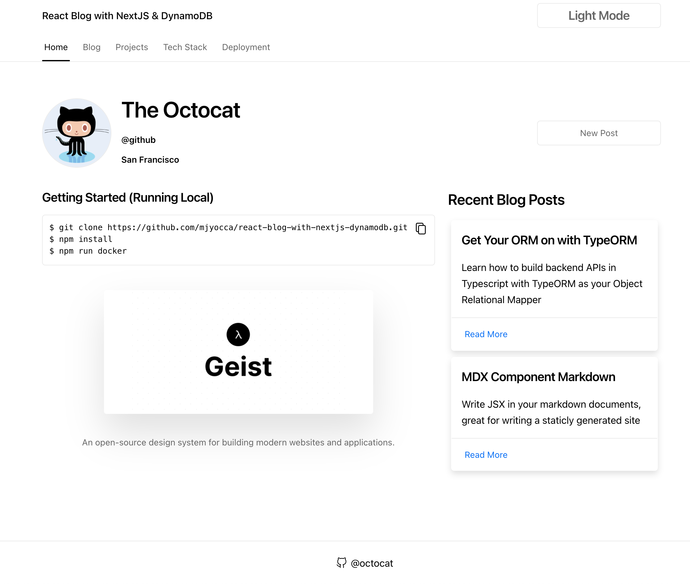
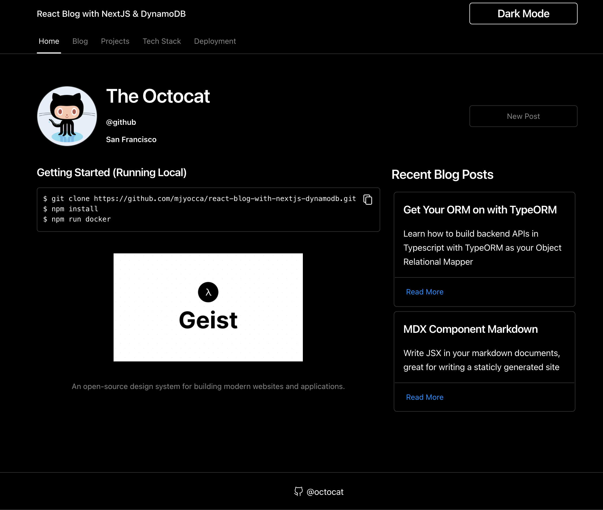

# React Blog~Portfolio with: NextJS / SWR / Geist React Library / DynamoDB

|      Light Mode      |      Dark Mode      |
| :------------------: | :-----------------: |
|  |  |

## Rundown

#### Important Notes

- This project is meant for POC/Learning
  - Would highly recommend better DynamoDB table design based on the queries you want to run
- No Authentication/Users set up
  - [next-auth-example](https://github.com/nextauthjs/next-auth-example)

#### Frontend

- **SWR** for data fetching
- **Geist React** components
- Home Page /
  - Pulls your github profile info set by `GITHUB_USERNAME=`
  - Grabs two blog post items from DynamoDB
- Page /blog
  - uses **SWRInfinite** with pagination cursor to fetch the next set of items from DynamoDB
- Page /projects
  - Pulls repos from your github profile set by, `GITHUB_USERNAME=`

#### Backend

Using NextJS **API Routes** `/pages/api/**/*`.

- When deploying to Vercel, these will automatically become isolated Serverless Functions.

## Retrospective

- Would design the DynamoDB table a little differently
  - possibly add generic PK & SK that can be overloaded with different entity types
  - Additionally would add a (GSI) Global Secondary Index with partition key of `year` and sort key/range key of the timestamp, to easily query the sorted order of recent blog posts. This current iteration uses a Scan with a limit & ExclusiveStartKey to limit the amount of items the request consumes.
- If implementing user/authentication would look into aws cognito, to make it seamless for exchanging AWS access to the provisioned dynamodb table.
- If you plan to make/alter the datastore frequently, you may be better off going with a traditional SQL relational database
  - Look into Aurora Serverless (MySQL/Postrgres)
- If creating new blog posts are infrequent, could easily opt for SSG (Static Site Generation) and run deployments when changes are made. And if that's the case, you would be better off using static markdown files for your blog store.
- Instead of solely using the API Routes provided by nextjs:
  - Would opt to have separate Lambda(s) + API Gateway to be the API, and use NextJS API Routes as a mask
  - Either Serverless framework / CloudFormation / Terraform etc to orchestrate infrasture/deployments.

## Local Setup

Create
**.env.development.local** file

```
GITHUB_USERNAME=[your github handle]
```

Start Local Server

```bash
npm run docker
```

## Deploy

Frontend/Backend API Options:

- Vercel
- AWS
- or (Anywhere you can run Docker/NodeJS)

Database ~ AWS (DynamoDB)

### Vercel

[Deploy](https://nextjs.org/docs/deployment)
[Env Variables](https://vercel.com/docs/concepts/projects/environment-variables)

### DynamoDB

- Create AWS Account
- (For Vercel)
  - Create a dedicated user in IAM with only the necessary permissions for DynamoDB access
  - Set the access and secret access keys in the environment variables hosted in Vercel
- If hosted within AWS, need to assign a service role to the compute resource (EC2 / ECS / Lambda) to access the DynamoDB table
